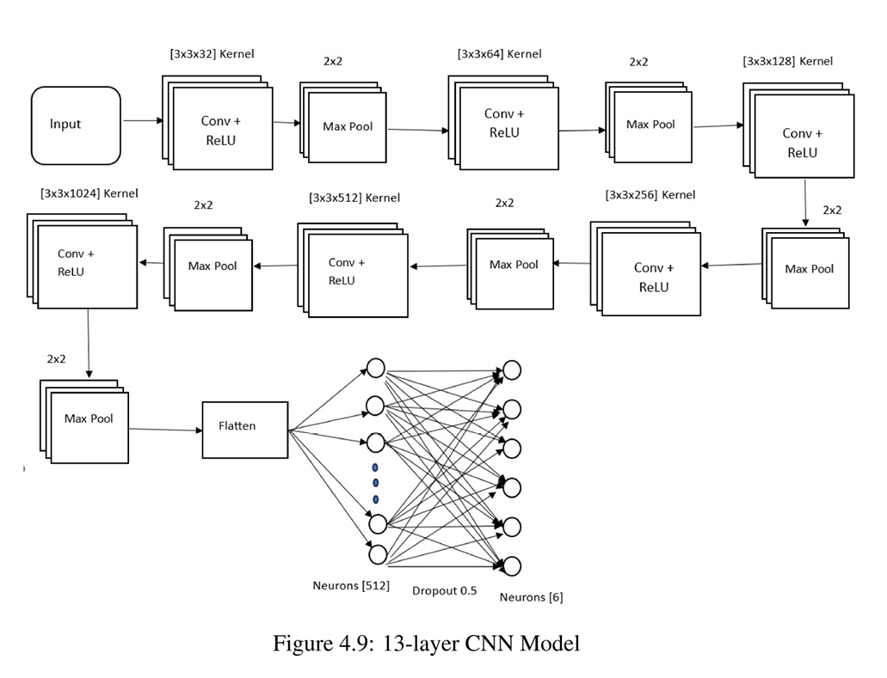
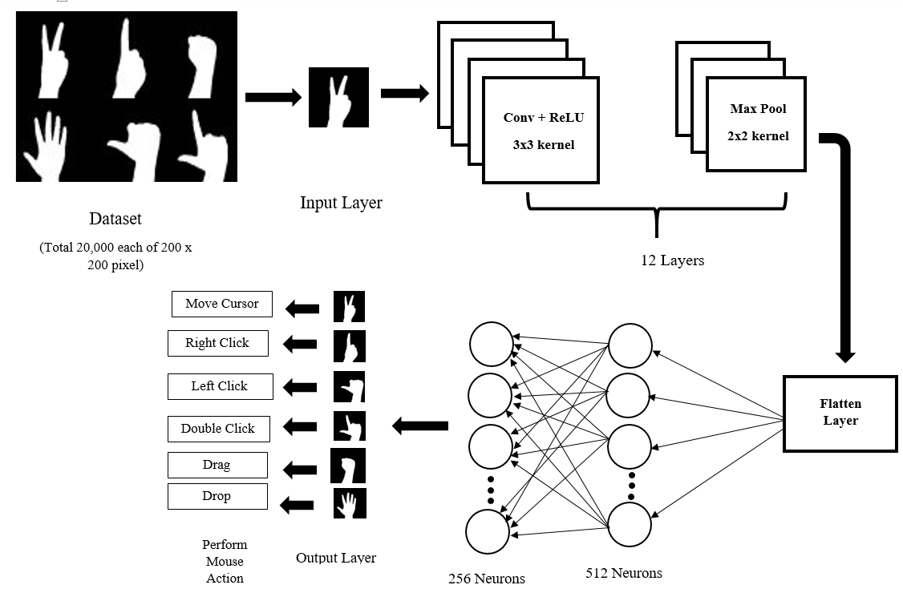

# Gesture Controlled Virtual Mouse

A computer-vision powered virtual mouse system that uses hand gestures to control mouse movements, clicks, and interactions removing the need for a physical mouse. Built using Python, OpenCV, Tensorflow, and PyAutoGUI, this project demonstrates the use of real-time hand tracking and gesture recognition.
## 🚀 Features

- Real-time hand tracking system using CNN model for hand gesture recognition.

- Use six different hand gestures for the mouse action.

- Smooth cursor movement with stabilization.


  
## 🛠️ Tech Stack
- **Language**: Python
- **Libraries**: OpenCV, PyAutoGUI, NumPy, Tensorflow, imutils, collections, keras
- **Tools**: Webcam, Virtual Environment (optional)


## ✋ Gesture Controls

| Gestures  | Description                    |
|----------------|-----------------------------------|
| ✌️ Index + Middle Finger       |Move cursor            |
| ☝️ Index Finger Up       |Right Click      |
| 👍Thumb Up | Left Click           |
| 👆 Index & Thumb Pinch  | Double Click  |
| ✊ Closed Fist   | Drag  |
|🖐️ Open Palm | Drop |


## Implemented CNN model 


## System Overview




## Installation


**Clone the repository:**

```bash
git clone https://github.com/sophiathapa/Hangman-Game.git

```


